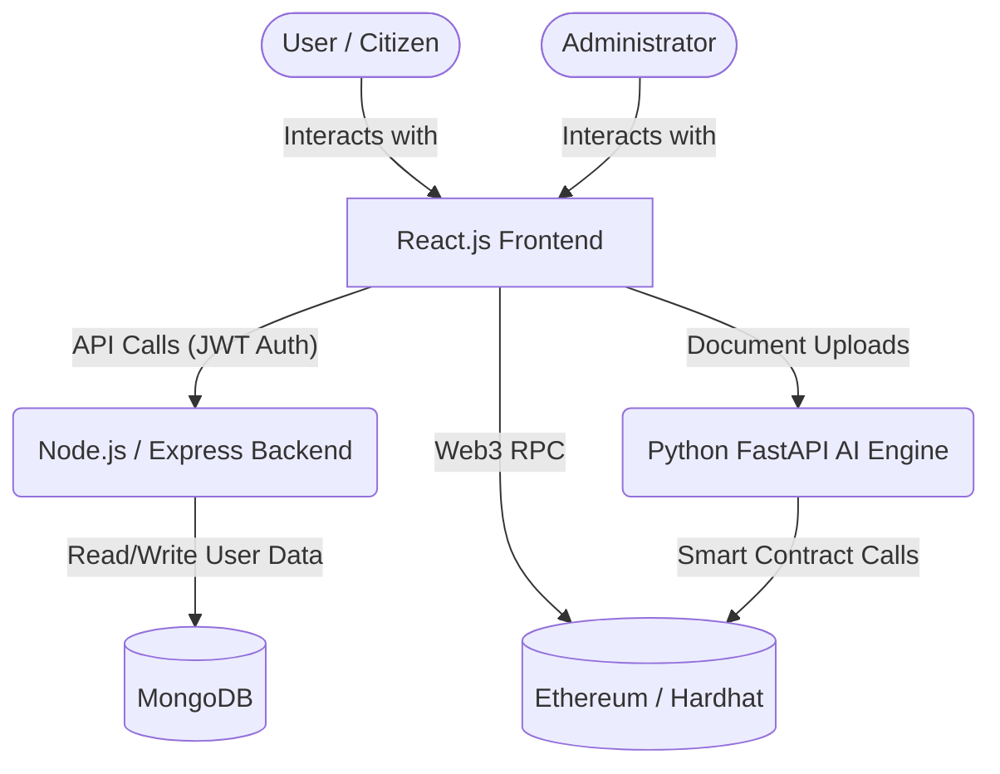

<div align="center">
  <h1>🏛️ Blockchain-Based E-Governance Platform with AI Intelligence</h1>
  <p>A decentralized, secure, and intelligent application for modern governance.</p>
</div>

<div align="center">
  
  
  
  
  
</div>

<br />

## 📖 Overview

The **E-Governance Platform** is a full-stack Decentralized Application (DApp) designed to bring transparency, efficiency, and intelligence to public sector services. It leverages the immutability of **Blockchain (Ethereum)** to securely record transactions (such as land registration) and utilizes **Artificial Intelligence (Python)** to automate decision-making processes, verify documents, and detect fraud. 

This platform bridges the gap between citizens and administrators, ensuring trustless and automated governance.

---

## ✨ Key Features

### 👤 For Citizens
- **Land Registry:** Securely register land and property assets on the immutable blockchain ledger.
- **Smart Document Verification:** Upload documents which are instantly analyzed and validated by the AI engine before being recorded on-chain.
- **Asset Management:** A dedicated dashboard to view, manage, and verify all personal registered properties.

### 🛡️ For Administrators
- **Intelligent Resource Allocation:** AI analyzes active data to predict shortfalls and automatically triggers funding requests.
- **One-Click Approvals:** Admins can effortlessly review AI-verified requests and release funds on-chain securely.
- **Fraud Monitoring:** Continuous AI security tracking to flag irregular transactions.

---

## 🏗️ Architecture & Tech Stack



* **Frontend:** React.js, Vite, Ethers.js
* **Backend:** Node.js, Express.js, JWT Authentication, MongoDB (Mongoose)
* **Blockchain:** Solidity, Hardhat, Local Ethereum Node
* **AI/ML Engine:** Python, FastAPI, Document Processing Models

---

## 🚀 Getting Started

To run this application, you will need to start the independent microservices (Blockchain, AI Engine, Backend Server, Frontend) simultaneously. We recommend opening **four separate terminal windows**.

### Prerequisites
- [Node.js](https://nodejs.org/) & npm installed
- [Python 3.8+](https://www.python.org/) installed
- [MetaMask](https://metamask.io/) browser extension
- MongoDB instance (Local or Atlas)

### 1️⃣ Start the Blockchain Network (Terminal 1)
Boot up your local Ethereum simulation network.
```bash
cd blockchain
npm install
npx hardhat node
```
* **Note:** Hardhat will provide you with 20 test accounts. Copy the **Private Key** of **Account #0**. This will be used as the **Admin** account in MetaMask.

### 2️⃣ Start the AI Engine (Terminal 2)
Run the Python FastAPI server responsible for AI document verification and predictions. 
```bash
# Navigate to the directory
cd ml_engine

# Activate Virtual Environment (Windows)
.\venv\Scripts\activate
# (For Mac/Linux use: source venv/bin/activate)

# Install dependencies (if you haven't)
pip install -r requirements.txt

# Start the server
uvicorn main:app --reload
```
* The engine will run on `http://127.0.0.1:8000`. You can test the endpoints manually at `http://127.0.0.1:8000/docs`.

### 3️⃣ Start the Backend Server (Terminal 3)
Run the Node.js API that manages off-chain data and citizen authentication.
```bash
cd server

# Install dependencies
npm install

# Start the Node instance
npm run dev
```
* Ensure you have configured your environment variables (like `MONGO_URI`) properly inside the `server/.env` file. Server runs on Port `5000`.

### 4️⃣ Start the React Frontend (Terminal 4)
Boot up the user interface.
```bash
cd client

# Install dependencies
npm install

# Start the development server
npm run dev
```
* Visit `http://localhost:5173` in your browser.

---

## 🦊 Setting Up MetaMask

To interact with the smart contracts, you must correctly set up your MetaMask wallet to point to your local node.

1. Open MetaMask and click on the network dropdown.
2. Select **Add Network** -> **Add a network manually**.
3. Fill in the following details:
   * **Network Name:** Hardhat Local
   * **New RPC URL:** `http://127.0.0.1:8545`
   * **Chain ID:** `31337`
   * **Currency Symbol:** `ETH`
4. Click **Save**.
5. **Import an Account:** Use the Account #0 Private Key you copied in Step 1 to import the Admin account. You can import other keys to simulate regular citizens.

---